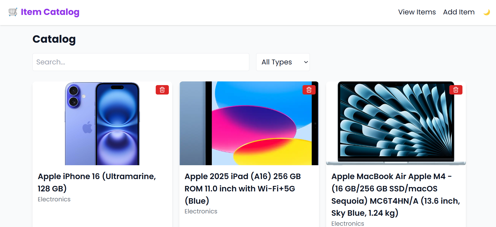
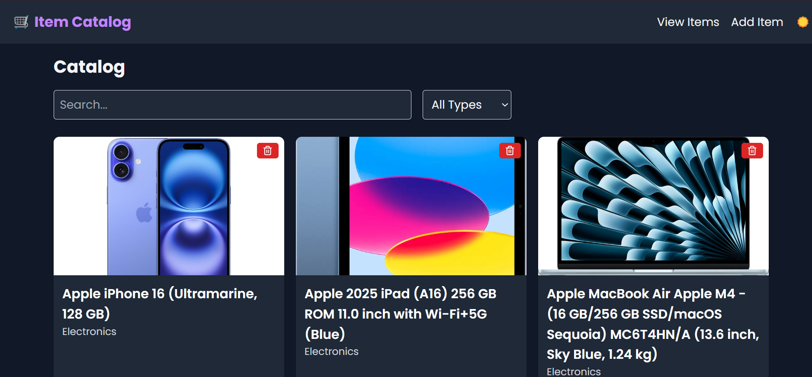
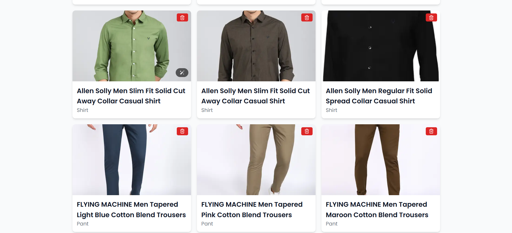
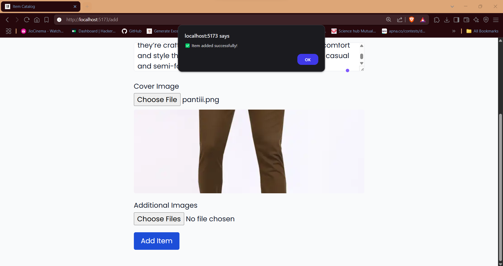
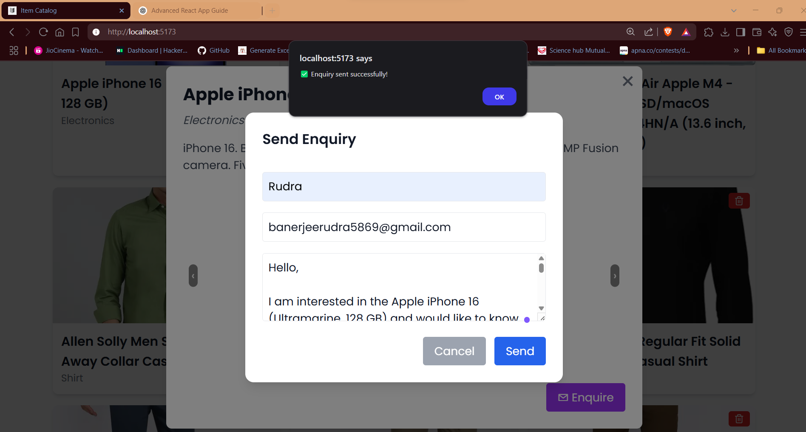
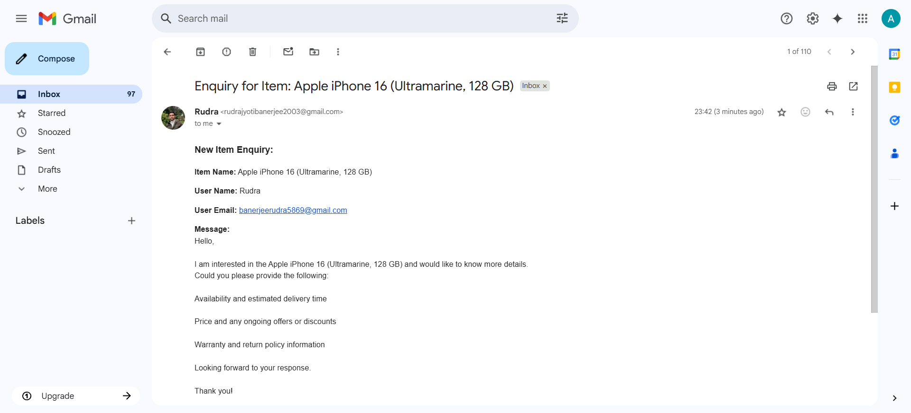
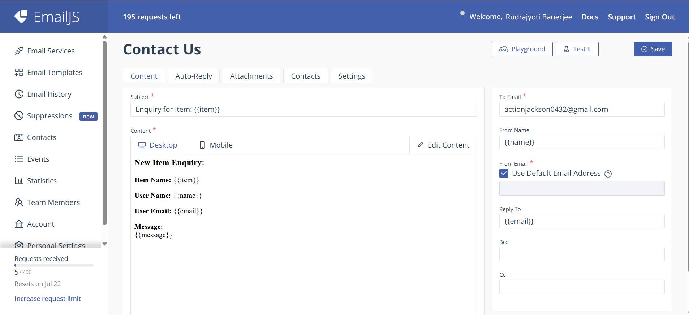

# Item Catalog App

A simple React app to manage and browse items with features like add, view, filter, search, dark mode, and email enquiries (via EmailJS). Built with Vite, Zustand, and Tailwind CSS.

---

## How to Run

1. **Clone the project**

```bash
git clone https://github.com/Rudrax03/item-catalog.git
cd item-catalog
```

2. **Install dependencies**

```bash
npm install
```

3. **Set up environment variables**

Create a `.env` file in the root and add:

```env
VITE_EMAILJS_PUBLIC_KEY=your_public_key
VITE_EMAILJS_SERVICE_ID=your_service_id
VITE_EMAILJS_TEMPLATE_ID=your_template_id
```

4. **Run the app**

```bash
npm run dev
```

Then open [http://localhost:5173](http://localhost:5173) in your browser.

---

## Hosting

The project is live and accessible at:

🔗 https://myitemcatalog.netlify.app/

---

## Screenshots

### 1. Home Page



### 2. Home Page (Dark Mode)



### 3. Items List with Filters



### 4. Add New Item



### 5. Send Enquiry Modal



### 6. Enquiry Email Received



### 7. EmailJS Template Configuration



---
